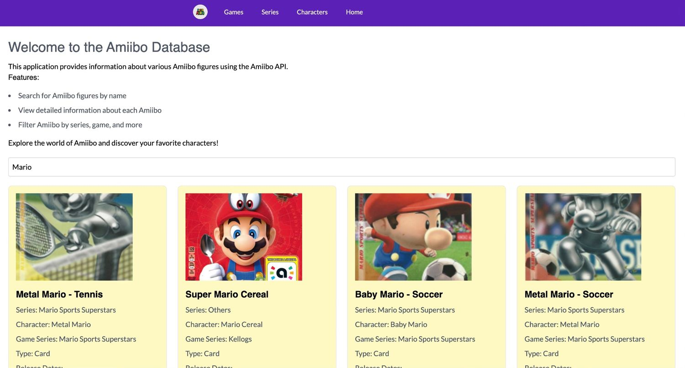
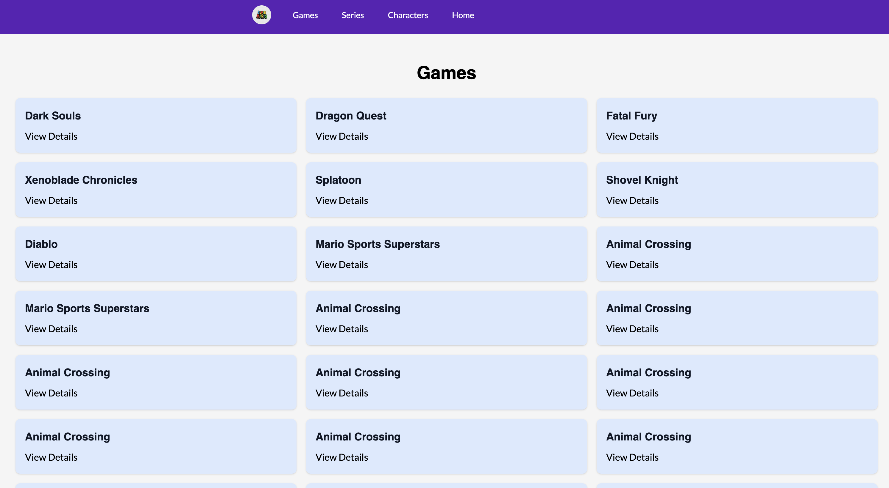
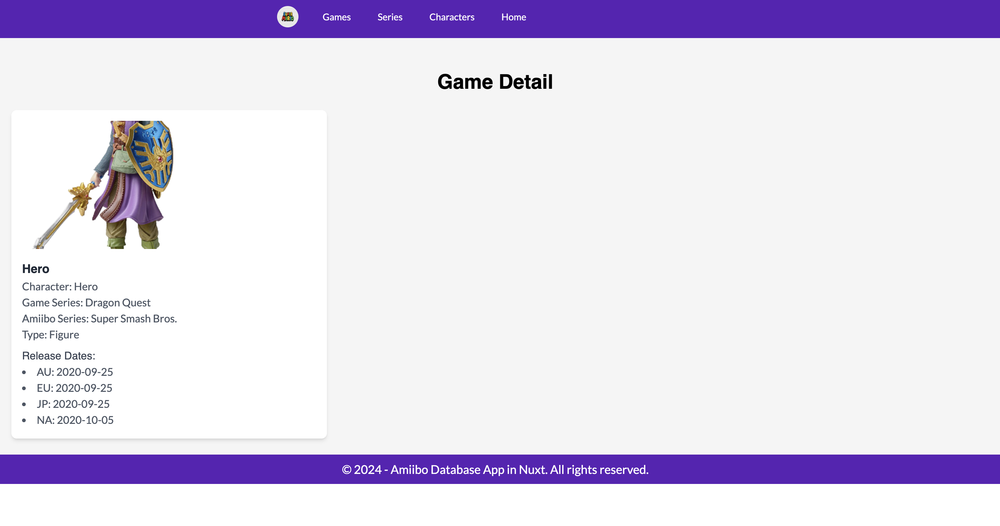

# Amiibo Nuxt Database

This is a hobby project created in Nuxt JS to test the features of Nuxt and getting hands-on experience with the framework. 
The project utilizes the [Amiibo API](https://www.amiiboapi.com/) to fetch data about various Amiibo figures. The Amiibo API provides the following features:

- Retrieve information about all available Amiibo figures.
- Get details about specific Amiibo, including name, series, and release dates.
- Access Amiibo images and artwork.
- Filter Amiibo data by game series, character, and type.

This integration allows the application to display up-to-date information about Amiibo figures dynamically.

Please Look at the [Nuxt documentation](https://nuxt.com/docs/getting-started/introduction) to learn more about Nuxt framework which is built on top of Vue JS.

Check out the [deployment documentation](https://nuxt.com/docs/getting-started/deployment) for more information.

## Features

- [Nuxt.js](https://nuxt.com/)
- [Tailwind CSS](https://tailwindcss.com/)
- [Headless UI](https://headlessui.dev/)
- [Pinia](https://pinia.vuejs.org/)

## Screenshots

First image shows the screenshot of the homepage where you can perform debounced search operation which gets results if they match from the API.



Second image is the screenshot of all the goods available related to games.



This image shows the detail page of a given game related articles.



## Installation

First, clone the repository:

```bash
git clone https://github.com/Apfirebolt/amiibo_api_database_in_nuxt
cd amiibo_nuxt_database
```

Then, install the dependencies:

```bash
# npm
npm install

# pnpm
pnpm install

# yarn
yarn install

# bun
bun install
```

## Usage

### Development

To start the development server:

```bash
# npm
npm run dev

# pnpm
pnpm dev

# yarn
yarn dev

# bun
bun run dev
```

### Production

To build the application for production:

```bash
# npm
npm run build

# pnpm
pnpm build

# yarn
yarn build

# bun
bun run build
```

To preview the production build locally:

```bash
# npm
npm run preview

# pnpm
pnpm preview

# yarn
yarn preview

# bun
bun run preview
```

## Configuration

### Tailwind CSS

Tailwind CSS is configured in the `tailwind.config.js` file. You can customize it according to your needs.

### Headless UI

Headless UI components can be used as described in the [Headless UI documentation](https://headlessui.dev/).

### Pinia

Pinia is configured in the `store` directory. You can create and manage your stores as described in the [Pinia documentation](https://pinia.vuejs.org/).

## License

This project is licensed under the MIT License.